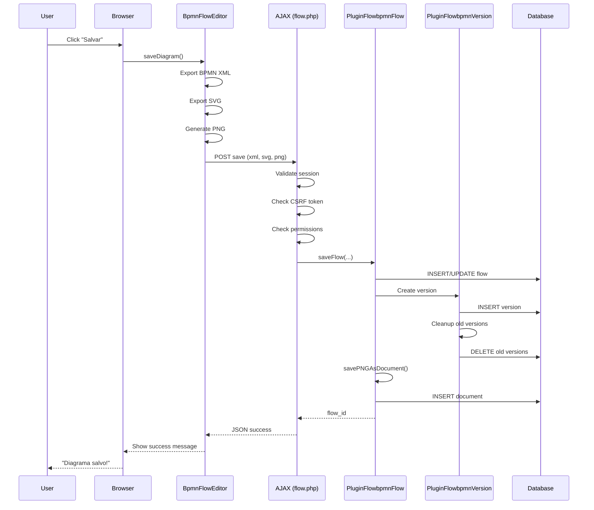
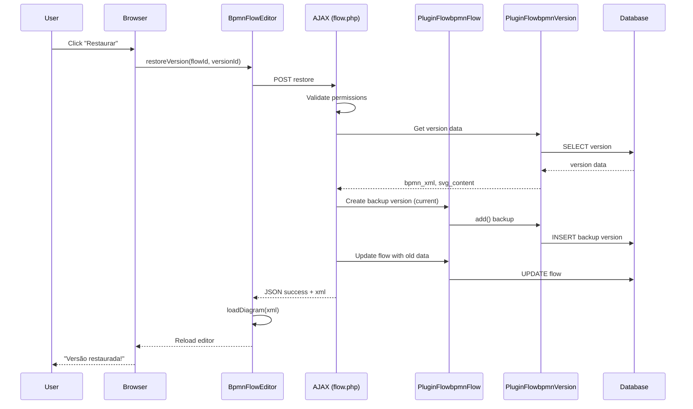
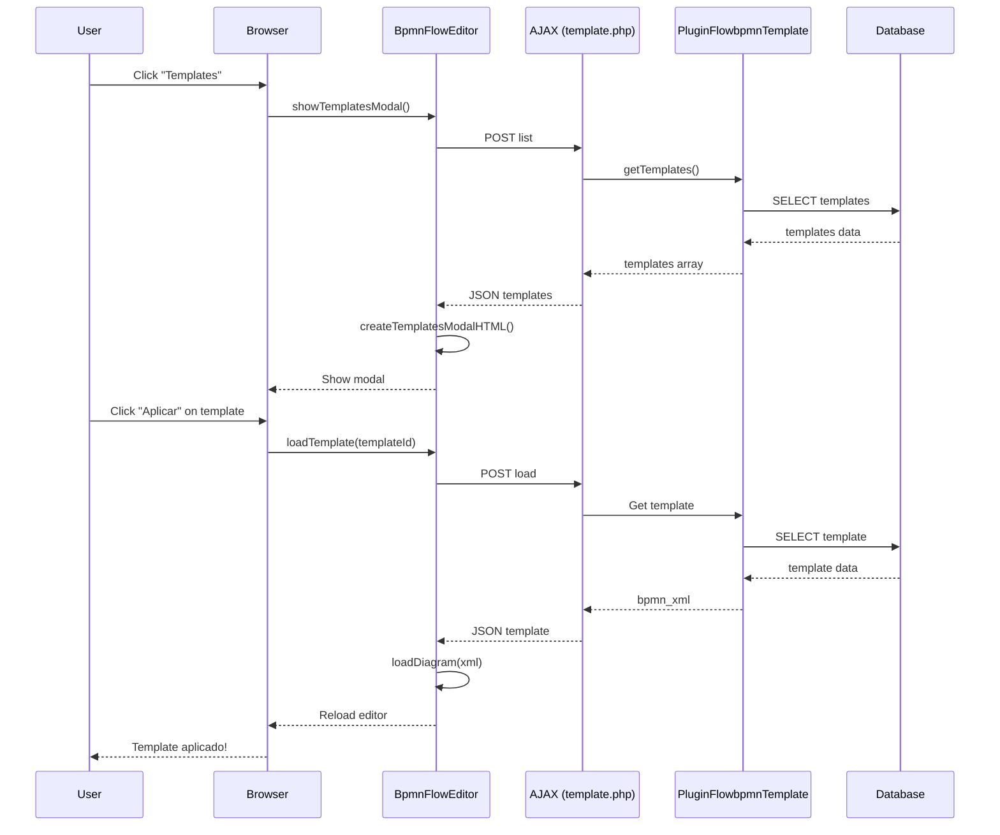

# FlowBPMN - Architecture

[](https://glpi-project.org/)

Documentação da arquitetura técnica do plugin FlowBPMN.

---

## 📚 Índice

1. [Visão Geral](#visão-geral)
2. [Camadas da Aplicação](#camadas-da-aplicação)
3. [Padrões de Design](#padrões-de-design)
4. [Fluxos Principais](#fluxos-principais)
5. [Segurança](#segurança)
6. [Performance](#performance)
7. [Escalabilidade](#escalabilidade)

---

## Visão Geral

### Arquitetura de Alto Nível

```
┌─────────────────────────────────────────────────────────┐
│                    CLIENT LAYER                          │
│  ┌────────────────────────────────────────────────────┐ │
│  │  Browser (Chrome, Firefox, Edge, Safari)           │ │
│  │  - BPMN.io Modeler (v18.6.1)                       │ │
│  │  - Bootstrap 5 UI                                  │ │
│  │  - BpmnFlowEditor (ES6+)                           │ │
│  └────────────────────────────────────────────────────┘ │
└───────────────────────┬─────────────────────────────────┘
                        │ HTTPS
                        │ JSON (AJAX)
┌───────────────────────▼─────────────────────────────────┐
│                  APPLICATION LAYER                       │
│  ┌────────────────────────────────────────────────────┐ │
│  │  GLPI Core (v11.0+)                                │ │
│  │  - Session Management                              │ │
│  │  - Authentication                                  │ │
│  │  - Authorization                                   │ │
│  │  - CSRF Protection                                 │ │
│  └────────────────────────────────────────────────────┘ │
│  ┌────────────────────────────────────────────────────┐ │
│  │  FlowBPMN Plugin                                   │ │
│  │  ┌──────────────┐  ┌──────────────┐               │ │
│  │  │ AJAX Layer   │  │ Class Layer  │               │ │
│  │  │ (16 files)   │→ │ (8 classes)  │               │ │
│  │  └──────────────┘  └──────────────┘               │ │
│  └────────────────────────────────────────────────────┘ │
└───────────────────────┬─────────────────────────────────┘
                        │ SQL
┌───────────────────────▼─────────────────────────────────┐
│                    DATA LAYER                            │
│  ┌────────────────────────────────────────────────────┐ │
│  │  MySQL/MariaDB                                     │ │
│  │  - glpi_plugin_flowbpmn_flows                      │ │
│  │  - glpi_plugin_flowbpmn_versions                   │ │
│  │  - glpi_plugin_flowbpmn_templates                  │ │
│  │  - glpi_plugin_flowbpmn_profiles                   │ │
│  │  - glpi_plugin_flowbpmn_configs                    │ │
│  └────────────────────────────────────────────────────┘ │
└─────────────────────────────────────────────────────────┘
```

---

## Camadas da Aplicação

### 1. Presentation Layer (Frontend)

**Responsabilidade**: Interface do usuário e interação

**Componentes**:
- **BPMN.io Modeler**: Editor visual de diagramas
- **Bootstrap 5**: Framework UI
- **BpmnFlowEditor**: Classe JavaScript principal
- **Modals**: Templates, Versões, Importação

**Tecnologias**:
- JavaScript ES6+
- HTML5
- CSS3
- Bootstrap 5
- Tabler Icons

---

### 2. Application Layer (Backend)

**Responsabilidade**: Lógica de negócio e processamento

**Componentes**:

#### AJAX Layer
- **flow.php**: Handler principal (save, delete, restore)
- **template.php**: Gerenciamento de templates
- **bpmn_versions.php**: Listagem de versões
- **load_diagram_from_item.php**: Carregamento de diagramas
- **list_items_with_diagrams.php**: Listagem para importação
- **import_items.php**: Importação de diagramas

#### Class Layer
- **PluginFlowbpmnFlow**: Gerenciamento de fluxos
- **PluginFlowbpmnVersion**: Controle de versão
- **PluginFlowbpmnTemplate**: Gerenciamento de templates
- **PluginFlowbpmnProfile**: Permissões
- **PluginFlowbpmnConfig**: Configurações
- **PluginFlowbpmnHelper**: Utilitários

**Tecnologias**:
- PHP 8.1+
- GLPI Core 11.0+

---

### 3. Data Layer (Database)

**Responsabilidade**: Persistência de dados

**Componentes**:
- 5 tabelas InnoDB
- Foreign keys com CASCADE
- Índices otimizados
- Soft deletes

**Tecnologias**:
- MySQL 5.7+ / MariaDB 10.3+
- InnoDB Engine
- UTF8MB4 Charset

---

## Padrões de Design

### 1. MVC (Model-View-Controller)

```
Model:      PluginFlowbpmnFlow (inc/flow.class.php)
View:       showForItem() + JavaScript UI
Controller: AJAX endpoints (ajax/*.php)
```

**Exemplo**:
```php
// Model
class PluginFlowbpmnFlow extends CommonDBTM {
    public static function saveFlow(...) { }
}

// Controller
// ajax/flow.php
$flow_id = PluginFlowbpmnFlow::saveFlow(...);

// View
// JavaScript
editor.saveDiagram();
```

---

### 2. Repository Pattern

Classes PHP atuam como repositórios de dados:

```php
// Repository
class PluginFlowbpmnFlow {
    public static function getForItem($itemtype, $items_id) {
        // Encapsula lógica de acesso a dados
        return $DB->request([...]);
    }
}

// Uso
$flow = PluginFlowbpmnFlow::getForItem('Ticket', 123);
```

---

### 3. Singleton

BpmnFlowEditor usa padrão Singleton implícito:

```javascript
class BpmnFlowEditor {
    constructor(options) {
        // Expõe instância globalmente
        window.BpmnFlowEditor_instance = this;
    }
}

// Acesso global (para eventos de modal)
window.BpmnFlowEditor_instance.restoreVersion(...);
```

---

### 4. Factory Pattern

Criação de modais usa padrão Factory:

```javascript
class BpmnFlowEditor {
    createTemplatesModalHTML(templates) {
        // Factory method para criar HTML do modal
        return `<div class="modal">...</div>`;
    }
    
    createVersionsModalHTML(versions) {
        // Factory method para criar HTML do modal
        return `<div class="modal">...</div>`;
    }
}
```

---

### 5. Observer Pattern

Event listeners para interação do usuário:

```javascript
// Observer
document.getElementById('save-btn').addEventListener('click', () => {
    this.saveDiagram(); // Notifica mudança
});

// Modeler events
this.modeler.on('commandStack.changed', () => {
    // Diagrama foi modificado
});
```

---

### 6. Strategy Pattern

Diferentes estratégias de exportação:

```javascript
class BpmnFlowEditor {
    exportBPMN() { /* Estratégia BPMN */ }
    exportSVG()  { /* Estratégia SVG */ }
    exportPNG()  { /* Estratégia PNG */ }
    exportPDF()  { /* Estratégia PDF */ }
}
```

---

## Fluxos Principais

### Fluxo 1: Salvamento de Diagrama



**Detalhes**:
1. Usuário clica em "Salvar"
2. JavaScript exporta BPMN XML, SVG e gera PNG
3. AJAX POST para `flow.php`
4. Validações de segurança (session, CSRF, permissions)
5. `PluginFlowbpmnFlow::saveFlow()` cria/atualiza registro
6. `post_updateItem()` cria nova versão
7. `PluginFlowbpmnVersion::add()` insere versão
8. Limpeza de versões antigas (se > max)
9. `savePNGAsDocument()` salva PNG como anexo
10. Retorna JSON com sucesso
11. UI exibe mensagem de confirmação

---

### Fluxo 2: Restauração de Versão



**Detalhes**:
1. Usuário clica em "Restaurar" em uma versão
2. Confirmação de ação
3. AJAX POST para `flow.php?action=restore`
4. Verifica permissão `can_restore`
5. Obtém dados da versão antiga
6. Cria backup da versão atual
7. Atualiza flow com dados da versão antiga
8. Retorna XML da versão restaurada
9. Editor recarrega com novo XML

---

### Fluxo 3: Carregamento de Template



---

## Segurança

### 1. Autenticação

**Método**: Session-based (GLPI Core)

```php
// Todos os AJAX endpoints
Session::checkLoginUser();

if (!Session::getLoginUserID()) {
    http_response_code(401);
    echo json_encode(['success' => false, 'message' => 'Não autenticado']);
    exit;
}
```

---

### 2. Autorização

**Método**: Permissões granulares por perfil e tipo de item

```php
// Verificação de permissões
if (!PluginFlowbpmnProfile::canEdit($itemtype)) {
    http_response_code(403);
    echo json_encode(['success' => false, 'message' => 'Sem permissão']);
    exit;
}
```

**Matriz de Permissões**:
- View: Visualizar diagramas
- Edit: Criar e modificar
- Delete: Deletar versões e templates
- Restore: Restaurar versões anteriores

---

### 3. CSRF Protection

**Método**: Token CSRF em todos os requests

```php
// Validação de token
Session::checkCSRF($_POST);
```

```javascript
// JavaScript
fetch('/plugins/flowbpmn/ajax/flow.php', {
    headers: {
        'X-CSRF-Token': this.getCSRFToken()
    }
});
```

---

### 4. SQL Injection Prevention

**Método**: Prepared statements (GLPI DBmysql)

```php
// ❌ NUNCA fazer isso
$query = "SELECT * FROM table WHERE id = " . $_POST['id'];

// ✅ SEMPRE usar prepared statements
$result = $DB->request([
    'FROM' => 'glpi_plugin_flowbpmn_flows',
    'WHERE' => ['id' => $id]  // Escapado automaticamente
]);
```

---

### 5. XSS Protection

**Método**: Output escaping

```php
// Escapar output
echo Html::cleanPostForTextArea($data);
echo htmlspecialchars($user_input, ENT_QUOTES, 'UTF-8');
```

```javascript
// JavaScript
escapeHtml(text) {
    const div = document.createElement('div');
    div.textContent = text;
    return div.innerHTML;
}
```

---

### 6. File Upload Security

**Método**: Validação de tipo e tamanho

```php
// Validar PNG
if (strpos($png_data, 'data:image/png;base64,') !== 0) {
    throw new Exception('Formato inválido');
}

// Limitar tamanho
$max_size = 5 * 1024 * 1024; // 5MB
if (strlen($png_data) > $max_size) {
    throw new Exception('Arquivo muito grande');
}
```

---

## Performance

### 1. Lazy Loading

Diagramas são carregados apenas quando necessário:

```javascript
// Não carrega até abrir a aba
getTabNameForItem() {
    // Apenas retorna nome da aba
}

displayTabContentForItem() {
    // Carrega editor apenas quando aba é aberta
    showForItem($item);
}
```

---

### 2. Paginação

Listas de versões e templates são paginadas:

```php
// Paginação de templates
$page = (int)($_POST['page'] ?? 1);
$per_page = 6;
$offset = ($page - 1) * $per_page;

$templates = $DB->request([
    'FROM' => 'glpi_plugin_flowbpmn_templates',
    'LIMIT' => $per_page,
    'OFFSET' => $offset
]);
```

---

### 3. Índices de Banco de Dados

Índices otimizados para queries frequentes:

```sql
-- Busca por item (muito frequente)
KEY `item` (`itemtype`, `items_id`)

-- Filtro por entidade
KEY `entities_id` (`entities_id`)

-- Ordenação por data
KEY `date_mod` (`date_mod`)
```

---

### 4. Limpeza Automática

Versões antigas são deletadas automaticamente:

```php
// Manter apenas últimas 10 versões
$max_versions = 10;
PluginFlowbpmnVersion::cleanupOldVersions($flow_id, $max_versions);
```

---

### 5. Compressão

Tabelas usam ROW_FORMAT=DYNAMIC para compressão:

```sql
CREATE TABLE `glpi_plugin_flowbpmn_flows` (
    ...
) ENGINE=InnoDB 
  DEFAULT CHARSET=utf8mb4 
  COLLATE=utf8mb4_unicode_ci 
  ROW_FORMAT=DYNAMIC;
```

---

## Escalabilidade

### 1. Suporte a Múltiplas Entidades

```php
// Respeita entidades GLPI
$flow->fields['entities_id'] = $item->fields['entities_id'];
$flow->fields['is_recursive'] = $item->fields['is_recursive'];
```

---

### 2. Relacionamento Polimórfico

Um único sistema para múltiplos tipos de itens:

```php
// Funciona com Ticket, Problem, Change
$flow = PluginFlowbpmnFlow::getForItem($itemtype, $items_id);
```

---

### 3. Arquivos Locais

BPMN.io é carregado localmente (não CDN):

```javascript
// Sem dependência de CDN externo
const BPMN_JS_URL = '/plugins/flowbpmn/lib/bpmn-js/bpmn-modeler.development.js';
```

**Vantagens**:
- Funciona offline
- Sem latência de CDN
- Controle de versão

---

### 4. Soft Deletes

Diagramas não são deletados fisicamente:

```php
// Soft delete
$flow->fields['is_deleted'] = 1;

// Queries filtram deletados
WHERE is_deleted = 0
```

**Vantagens**:
- Recuperação possível
- Auditoria completa
- Performance (UPDATE vs DELETE)

---

## Recursos Adicionais

- [Developer Guide](DEVELOPER_GUIDE.md)
- [API Reference](API_REFERENCE.md)
- [Database Schema](DATABASE_SCHEMA.md)

---

**Arquitetura Documentada!** 🏗️

Para dúvidas, consulte o [GitHub](https://github.com/diegojucah/FlowBPMN).
