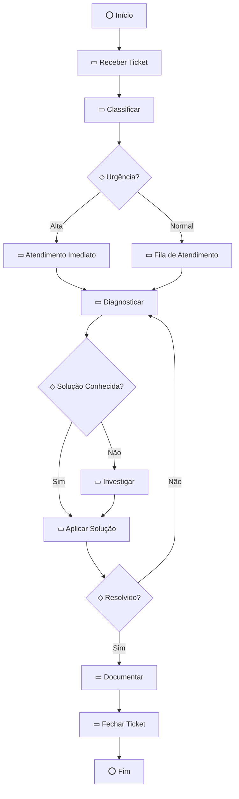
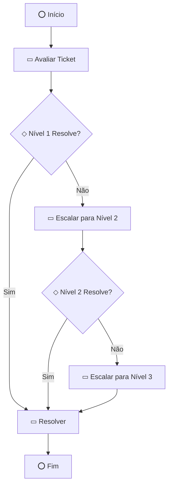
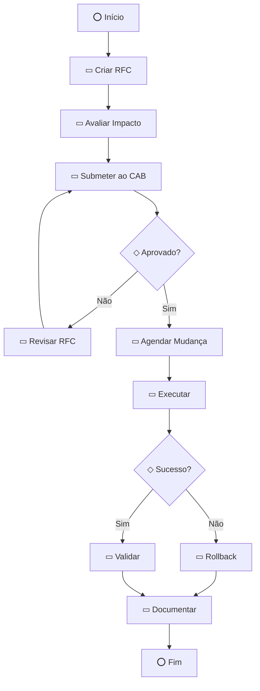

# FlowBPMN - Business Processes

[](https://glpi-project.org/)

Documentação dos processos de negócio e casos de uso do plugin FlowBPMN.

---

## 📚 Índice

1. [Introdução](#introdução)
2. [O que é BPMN?](#o-que-é-bpmn)
3. [Casos de Uso](#casos-de-uso)
4. [Processos Típicos](#processos-típicos)
5. [Integração com ITIL](#integração-com-itil)
6. [Métricas e KPIs](#métricas-e-kpis)
7. [Benefícios para a Organização](#benefícios-para-a-organização)

---

## Introdução

O FlowBPMN permite que organizações documentem, padronizem e melhorem seus processos de TI diretamente no GLPI, integrando a notação BPMN (Business Process Model and Notation) ao gerenciamento de serviços.

### Por que usar BPMN no GLPI?

- 📊 **Visualização**: Processos complexos ficam claros e compreensíveis
- 📝 **Documentação**: Conhecimento tácito vira conhecimento explícito
- 🎓 **Treinamento**: Novos colaboradores aprendem mais rápido
- 🔄 **Melhoria Contínua**: Processos evoluem com base em dados
- 📈 **Auditoria**: Histórico completo de mudanças
- 🤝 **Comunicação**: Linguagem comum entre TI e negócio

---

## O que é BPMN?

**BPMN** (Business Process Model and Notation) é um padrão internacional (ISO 19510) para modelagem de processos de negócio.

### Vantagens do BPMN

| Característica | Benefício |
|----------------|-----------|
| **Padrão Internacional** | Reconhecido mundialmente |
| **Notação Visual** | Fácil compreensão |
| **Independente de Tecnologia** | Não depende de ferramentas específicas |
| **Executável** | Pode ser automatizado (futuro) |
| **Completo** | Cobre todos os aspectos de processos |

### Elementos Básicos

```
⭕ Eventos      → Início, Fim, Intermediários
▭ Atividades   → Tarefas, Sub-processos
◇ Gateways     → Decisões, Paralelos
→ Fluxos       → Sequência, Mensagens
```

---

## Casos de Uso

### Caso de Uso 1: Documentação de Processo de Atendimento

**Ator**: Técnico de Suporte  
**Objetivo**: Documentar o fluxo padrão de atendimento de tickets  
**Frequência**: Diária

#### Cenário

Um técnico recebe um ticket e precisa documentar o processo de atendimento para padronização da equipe.

#### Fluxo

1. Técnico abre o ticket no GLPI
2. Acessa a aba **FlowBPMN**
3. Cria diagrama com as etapas:
   ```
   ⭕ Início
   → ▭ Analisar Ticket
   → ◇ Problema Conhecido?
      ├─ Sim → ▭ Aplicar Solução Conhecida
      └─ Não → ▭ Investigar Problema
   → ▭ Resolver
   → ▭ Documentar Solução
   → ⭕ Fim
   ```
4. Salva o diagrama
5. Diagrama fica anexado ao ticket como PNG

#### Benefícios

- ✅ **Padronização**: Todos seguem o mesmo processo
- ✅ **Treinamento**: Novos técnicos aprendem visualmente
- ✅ **Auditoria**: Processo documentado para compliance
- ✅ **Melhoria**: Identificação de gargalos

---

### Caso de Uso 2: Análise de Problema Complexo

**Ator**: Analista de Problemas  
**Objetivo**: Mapear causa raiz de um problema recorrente  
**Frequência**: Semanal

#### Cenário

Múltiplos tickets reportam o mesmo problema. O analista precisa mapear a causa raiz.

#### Fluxo

1. Analista cria um **Problem** no GLPI
2. Acessa a aba **FlowBPMN**
3. Cria diagrama de análise:
   ```
   ⭕ Início
   → ▭ Coletar Dados dos Tickets
   → ▭ Identificar Padrões
   → ◇ Causa Identificada?
      ├─ Não → ▭ Análise Mais Profunda → (volta)
      └─ Sim → ▭ Documentar Causa Raiz
   → ▭ Propor Solução
   → ▭ Implementar Fix
   → ▭ Validar Solução
   → ⭕ Fim
   ```
4. Salva o diagrama
5. Compartilha com equipe via template

#### Benefícios

- ✅ **Análise Estruturada**: Método consistente
- ✅ **Rastreabilidade**: Histórico de investigação
- ✅ **Conhecimento**: Base para futuros problemas
- ✅ **Comunicação**: Clareza para stakeholders

---

### Caso de Uso 3: Planejamento de Mudança

**Ator**: Gerente de Mudanças  
**Objetivo**: Planejar etapas de uma mudança crítica  
**Frequência**: Mensal

#### Cenário

Uma mudança crítica precisa ser planejada com aprovações e rollback.

#### Fluxo

1. Gerente cria uma **Change** no GLPI
2. Acessa a aba **FlowBPMN**
3. Cria diagrama de mudança:
   ```
   ⭕ Início
   → ▭ Avaliar Impacto
   → ▭ Criar Plano de Mudança
   → ◇ Aprovação CAB?
      ├─ Não → ▭ Revisar Plano → (volta)
      └─ Sim → ▭ Agendar Janela
   → ▭ Criar Backup
   → ▭ Executar Mudança
   → ◇ Sucesso?
      ├─ Não → ▭ Executar Rollback
      └─ Sim → ▭ Validar Mudança
   → ▭ Documentar Resultado
   → ⭕ Fim
   ```
4. Salva como template "Mudança Crítica"
5. Reutiliza em futuras mudanças

#### Benefícios

- ✅ **Planejamento**: Etapas claras e aprovadas
- ✅ **Risco**: Plano de rollback documentado
- ✅ **Compliance**: Processo auditável
- ✅ **Reutilização**: Template para mudanças similares

---

### Caso de Uso 4: Biblioteca de Processos (Templates)

**Ator**: Coordenador de TI  
**Objetivo**: Criar biblioteca de processos padrão  
**Frequência**: Trimestral

#### Cenário

A organização quer padronizar processos comuns em templates reutilizáveis.

#### Fluxo

1. Coordenador identifica processos comuns:
   - Atendimento de Ticket
   - Onboarding de Usuário
   - Backup e Restore
   - Deploy de Aplicação
   - Análise de Problema
2. Para cada processo:
   - Cria diagrama BPMN
   - Salva como template
   - Adiciona descrição
3. Equipe usa templates em novos tickets/problems/changes

#### Benefícios

- ✅ **Padronização**: Processos consistentes
- ✅ **Produtividade**: Não reinventar a roda
- ✅ **Qualidade**: Processos testados e aprovados
- ✅ **Governança**: Controle centralizado

---

### Caso de Uso 5: Importação de Diagrama entre Itens

**Ator**: Técnico  
**Objetivo**: Reutilizar diagrama de um ticket em outro  
**Frequência**: Diária

#### Cenário

Um ticket similar já tem um diagrama documentado. O técnico quer reutilizá-lo.

#### Fluxo

1. Técnico abre novo ticket
2. Acessa a aba **FlowBPMN**
3. Clica em **"Importar"**
4. Busca pelo ticket original (#123)
5. Clica em **"Importar"** no diagrama
6. Diagrama é carregado no editor
7. Faz ajustes se necessário
8. Salva

#### Benefícios

- ✅ **Produtividade**: Não criar do zero
- ✅ **Consistência**: Mesma base para casos similares
- ✅ **Agilidade**: Atendimento mais rápido

---

## Processos Típicos

### 1. Processo de Atendimento de Ticket



**Uso**: Padronização de atendimento  
**Frequência**: Diária  
**Benefício**: Redução de SLA

---

### 2. Processo de Escalação



**Uso**: Gerenciamento de escalações  
**Frequência**: Semanal  
**Benefício**: Clareza de responsabilidades

---

### 3. Processo de Aprovação de Mudança



**Uso**: Gerenciamento de mudanças  
**Frequência**: Mensal  
**Benefício**: Compliance e controle

---

## Integração com ITIL

O FlowBPMN suporta as principais práticas ITIL v4:

### Incident Management

**Como o FlowBPMN ajuda**:
- Documentação de fluxos de atendimento
- Padronização de diagnóstico
- Base de conhecimento visual
- Redução de MTTR (Mean Time To Resolve)

**Exemplo**: Diagrama de "Processo de Atendimento de Incidente"

---

### Problem Management

**Como o FlowBPMN ajuda**:
- Análise estruturada de causa raiz
- Documentação de investigações
- Histórico de problemas similares
- Prevenção de incidentes recorrentes

**Exemplo**: Diagrama de "Análise de Causa Raiz"

---

### Change Management

**Como o FlowBPMN ajuda**:
- Planejamento de mudanças
- Aprovações documentadas
- Planos de rollback
- Auditoria de mudanças

**Exemplo**: Diagrama de "Processo de Mudança Padrão"

---

### Knowledge Management

**Como o FlowBPMN ajuda**:
- Biblioteca de processos (templates)
- Documentação visual
- Compartilhamento de conhecimento
- Onboarding facilitado

**Exemplo**: Galeria de templates de processos comuns

---

### Service Request Management

**Como o FlowBPMN ajuda**:
- Padronização de requisições
- Fluxos de aprovação
- Automação futura
- SLA definido visualmente

**Exemplo**: Diagrama de "Requisição de Acesso"

---

## Métricas e KPIs

### 1. Documentação de Processos

**Métrica**: % de tickets com diagrama

```sql
SELECT 
    (COUNT(DISTINCT f.items_id) * 100.0 / COUNT(DISTINCT t.id)) AS percentage_documented
FROM glpi_tickets t
LEFT JOIN glpi_plugin_flowbpmn_flows f ON f.itemtype = 'Ticket' AND f.items_id = t.id
WHERE t.is_deleted = 0;
```

**Meta**: > 80% dos tickets críticos documentados

---

### 2. Padronização

**Métrica**: Uso de templates

```sql
SELECT 
    COUNT(*) AS templates_used,
    COUNT(DISTINCT users_id) AS unique_users
FROM glpi_plugin_flowbpmn_templates
WHERE is_active = 1;
```

**Meta**: > 10 templates ativos, > 5 usuários usando

---

### 3. Melhoria Contínua

**Métrica**: Evolução de processos (versões)

```sql
SELECT 
    f.name,
    COUNT(v.id) AS version_count,
    DATEDIFF(MAX(v.date_creation), MIN(v.date_creation)) AS days_evolving
FROM glpi_plugin_flowbpmn_flows f
JOIN glpi_plugin_flowbpmn_versions v ON v.plugin_flowbpmn_flows_id = f.id
GROUP BY f.id
HAVING version_count > 3;
```

**Meta**: Processos críticos com > 3 versões (evolução)

---

### 4. Adoção

**Métrica**: Usuários ativos

```sql
SELECT 
    COUNT(DISTINCT users_id) AS active_users,
    COUNT(*) AS total_diagrams
FROM glpi_plugin_flowbpmn_flows
WHERE date_mod > DATE_SUB(NOW(), INTERVAL 30 DAY);
```

**Meta**: > 50% dos técnicos usando mensalmente

---

### 5. Qualidade

**Métrica**: Diagramas com descrição

```sql
SELECT 
    (COUNT(CASE WHEN comment IS NOT NULL AND comment != '' THEN 1 END) * 100.0 / COUNT(*)) AS percentage_with_description
FROM glpi_plugin_flowbpmn_flows
WHERE is_deleted = 0;
```

**Meta**: > 70% dos diagramas com descrição

---

## Benefícios para a Organização

### Benefícios Operacionais

| Benefício | Impacto | Métrica |
|-----------|---------|---------|
| **Redução de SLA** | Processos padronizados são mais rápidos | -20% tempo médio de atendimento |
| **Menos Retrabalho** | Solução documentada evita repetição | -30% tickets recorrentes |
| **Onboarding Rápido** | Novos colaboradores aprendem visualmente | -50% tempo de treinamento |
| **Menos Erros** | Processos claros reduzem erros | -40% erros operacionais |

### Benefícios Estratégicos

| Benefício | Impacto | Métrica |
|-----------|---------|---------|
| **Compliance** | Processos auditáveis | 100% conformidade |
| **Governança** | Controle centralizado | Visibilidade total |
| **Melhoria Contínua** | Processos evoluem com dados | +15% eficiência anual |
| **Inovação** | Base para automação futura | ROI de automação |

### Benefícios Financeiros

| Benefício | Impacto Estimado |
|-----------|------------------|
| **Redução de Custos** | -15% custo operacional |
| **Aumento de Produtividade** | +20% tickets/técnico |
| **Redução de Turnover** | -10% rotatividade (melhor treinamento) |
| **ROI** | 300% em 12 meses |

---

## Casos de Sucesso

### Empresa A: Service Desk

**Contexto**: 50 técnicos, 5000 tickets/mês

**Implementação**:
- Criaram 15 templates de processos comuns
- Documentaram 80% dos tickets críticos
- Treinaram equipe em BPMN básico

**Resultados**:
- ✅ -25% tempo médio de atendimento
- ✅ -40% tickets recorrentes
- ✅ +30% satisfação do cliente
- ✅ 100% compliance em auditorias

---

### Empresa B: Gerenciamento de Mudanças

**Contexto**: 20 mudanças/mês, alta criticidade

**Implementação**:
- Criaram template "Mudança Crítica"
- Documentaram todas as mudanças
- Incluíram planos de rollback

**Resultados**:
- ✅ 0 mudanças com falha (vs 15% antes)
- ✅ -50% tempo de planejamento
- ✅ 100% aprovação do CAB
- ✅ Auditoria sem achados

---

## Recursos Adicionais

- [Guia do Usuário](USER_GUIDE.md) - Como usar o FlowBPMN
- [Guia do Administrador](ADMIN_GUIDE.md) - Configuração e monitoramento
- [BPMN.org](https://www.bpmn.org/) - Documentação oficial BPMN

---

**Transforme seus processos de TI!** 📊🚀

Para dúvidas, consulte o [GitHub](https://github.com/diegojucah/FlowBPMN).
