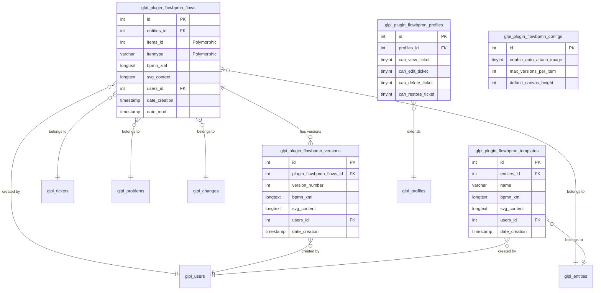

# FlowBPMN - Database Schema

[](https://www.mysql.com/)
[](https://mariadb.org/)

Documentação completa do schema do banco de dados do plugin FlowBPMN.

---

## 📚 Índice

1. [Visão Geral](#visão-geral)
2. [Diagrama ER](#diagrama-er)
3. [Tabelas Detalhadas](#tabelas-detalhadas)
4. [Relacionamentos](#relacionamentos)
5. [Índices e Performance](#índices-e-performance)
6. [Queries Úteis](#queries-úteis)
7. [Migrations](#migrations)

---

## Visão Geral

O FlowBPMN utiliza **5 tabelas** para gerenciar diagramas BPMN, versões, templates, permissões e configurações.

### Resumo das Tabelas

| Tabela | Registros | Tamanho Estimado | Função |
|--------|-----------|------------------|--------|
| `glpi_plugin_flowbpmn_flows` | Variável | ~10-50 MB | Diagramas BPMN principais |
| `glpi_plugin_flowbpmn_versions` | Variável | ~50-200 MB | Histórico de versões |
| `glpi_plugin_flowbpmn_templates` | Baixo | ~1-5 MB | Templates reutilizáveis |
| `glpi_plugin_flowbpmn_profiles` | = Perfis GLPI | < 1 MB | Permissões por perfil |
| `glpi_plugin_flowbpmn_configs` | 1 | < 1 KB | Configurações globais |

### Características

- **Engine**: InnoDB (suporte a transações e foreign keys)
- **Charset**: utf8mb4 (suporte completo a Unicode)
- **Collation**: utf8mb4_unicode_ci (case-insensitive)
- **Row Format**: DYNAMIC (compressão eficiente)

---

## Diagrama ER



---

## Tabelas Detalhadas

### 1. glpi_plugin_flowbpmn_flows

**Descrição**: Armazena os diagramas BPMN principais vinculados a Tickets, Problems ou Changes.

**Colunas**:

| Coluna | Tipo | Null | Default | Descrição |
|--------|------|------|---------|-----------|
| `id` | int unsigned | NO | AUTO_INCREMENT | Chave primária |
| `entities_id` | int unsigned | NO | 0 | Entidade GLPI |
| `is_recursive` | tinyint | NO | 0 | Recursividade de entidade |
| `items_id` | int unsigned | NO | 0 | ID do item vinculado |
| `itemtype` | varchar(100) | NO | - | Tipo do item (Ticket/Problem/Change) |
| `name` | varchar(255) | YES | NULL | Nome do diagrama |
| `comment` | text | YES | NULL | Comentário/descrição |
| `bpmn_xml` | longtext | YES | NULL | Conteúdo BPMN XML |
| `svg_content` | longtext | YES | NULL | Conteúdo SVG para preview |
| `is_active` | tinyint | NO | 1 | Ativo? |
| `is_deleted` | tinyint | NO | 0 | Deletado? (soft delete) |
| `users_id` | int unsigned | NO | 0 | Usuário criador |
| `users_id_tech` | int unsigned | NO | 0 | Técnico responsável |
| `groups_id_tech` | int unsigned | NO | 0 | Grupo técnico responsável |
| `date_creation` | timestamp | YES | NULL | Data de criação |
| `date_mod` | timestamp | YES | NULL | Data de modificação |

**Índices**:

```sql
PRIMARY KEY (`id`)
KEY `item` (`itemtype`, `items_id`)           -- Busca por item
KEY `entities_id` (`entities_id`)             -- Filtro por entidade
KEY `is_recursive` (`is_recursive`)           -- Filtro recursivo
KEY `is_active` (`is_active`)                 -- Filtro ativo
KEY `is_deleted` (`is_deleted`)               -- Filtro deletado
KEY `users_id` (`users_id`)                   -- Filtro por usuário
KEY `users_id_tech` (`users_id_tech`)         -- Filtro por técnico
KEY `groups_id_tech` (`groups_id_tech`)       -- Filtro por grupo
KEY `date_creation` (`date_creation`)         -- Ordenação por data
KEY `date_mod` (`date_mod`)                   -- Ordenação por modificação
```

**Tamanho Estimado**:
- BPMN XML: ~10-50 KB por diagrama
- SVG: ~20-100 KB por diagrama
- **Total**: ~30-150 KB por registro

---

### 2. glpi_plugin_flowbpmn_versions

**Descrição**: Armazena histórico de versões de cada diagrama.

**Colunas**:

| Coluna | Tipo | Null | Default | Descrição |
|--------|------|------|---------|-----------|
| `id` | int unsigned | NO | AUTO_INCREMENT | Chave primária |
| `plugin_flowbpmn_flows_id` | int unsigned | NO | - | FK para flows |
| `version_number` | int unsigned | NO | 1 | Número da versão |
| `name` | varchar(255) | YES | NULL | Nome da versão |
| `comment` | text | YES | NULL | Comentário da versão |
| `bpmn_xml` | longtext | YES | NULL | Conteúdo BPMN XML |
| `svg_content` | longtext | YES | NULL | Conteúdo SVG |
| `users_id` | int unsigned | NO | 0 | Usuário que criou versão |
| `date_creation` | timestamp | YES | NULL | Data de criação |

**Índices**:

```sql
PRIMARY KEY (`id`)
KEY `plugin_flowbpmn_flows_id` (`plugin_flowbpmn_flows_id`)
KEY `version_number` (`version_number`)
KEY `users_id` (`users_id`)
KEY `date_creation` (`date_creation`)
```

**Foreign Keys**:

```sql
CONSTRAINT `glpi_plugin_flowbpmn_versions_ibfk_1`
    FOREIGN KEY (`plugin_flowbpmn_flows_id`)
    REFERENCES `glpi_plugin_flowbpmn_flows` (`id`)
    ON DELETE CASCADE
```

**Limpeza Automática**: Mantém apenas as últimas N versões (padrão: 10).

---

### 3. glpi_plugin_flowbpmn_templates

**Descrição**: Armazena templates BPMN reutilizáveis.

**Colunas**:

| Coluna | Tipo | Null | Default | Descrição |
|--------|------|------|---------|-----------|
| `id` | int unsigned | NO | AUTO_INCREMENT | Chave primária |
| `entities_id` | int unsigned | NO | 0 | Entidade GLPI |
| `is_recursive` | tinyint | NO | 0 | Recursividade |
| `name` | varchar(255) | YES | NULL | Nome do template |
| `comment` | text | YES | NULL | Descrição |
| `bpmn_xml` | longtext | YES | NULL | Conteúdo BPMN XML |
| `svg_content` | longtext | YES | NULL | Conteúdo SVG (thumbnail) |
| `is_active` | tinyint | NO | 1 | Ativo? |
| `is_public` | tinyint | NO | 0 | Público? (futuro) |
| `users_id` | int unsigned | NO | 0 | Usuário criador |
| `date_creation` | timestamp | YES | NULL | Data de criação |
| `date_mod` | timestamp | YES | NULL | Data de modificação |

**Índices**:

```sql
PRIMARY KEY (`id`)
KEY `entities_id` (`entities_id`)
KEY `is_recursive` (`is_recursive`)
KEY `is_public` (`is_public`)
KEY `users_id` (`users_id`)
KEY `date_mod` (`date_mod`)
```

---

### 4. glpi_plugin_flowbpmn_profiles

**Descrição**: Armazena permissões granulares por perfil GLPI.

**Colunas**:

| Coluna | Tipo | Null | Default | Descrição |
|--------|------|------|---------|-----------|
| `id` | int unsigned | NO | AUTO_INCREMENT | Chave primária |
| `profiles_id` | int unsigned | NO | 0 | FK para glpi_profiles |
| `can_view_ticket` | tinyint | NO | 0 | Pode visualizar em Tickets |
| `can_edit_ticket` | tinyint | NO | 0 | Pode editar em Tickets |
| `can_delete_ticket` | tinyint | NO | 0 | Pode deletar em Tickets |
| `can_restore_ticket` | tinyint | NO | 0 | Pode restaurar em Tickets |
| `can_view_problem` | tinyint | NO | 0 | Pode visualizar em Problems |
| `can_edit_problem` | tinyint | NO | 0 | Pode editar em Problems |
| `can_delete_problem` | tinyint | NO | 0 | Pode deletar em Problems |
| `can_restore_problem` | tinyint | NO | 0 | Pode restaurar em Problems |
| `can_view_change` | tinyint | NO | 0 | Pode visualizar em Changes |
| `can_edit_change` | tinyint | NO | 0 | Pode editar em Changes |
| `can_delete_change` | tinyint | NO | 0 | Pode deletar em Changes |
| `can_restore_change` | tinyint | NO | 0 | Pode restaurar em Changes |

**Índices**:

```sql
PRIMARY KEY (`id`)
UNIQUE KEY `profiles_id` (`profiles_id`)
```

**Foreign Keys**:

```sql
CONSTRAINT `glpi_plugin_flowbpmn_profiles_ibfk_1`
    FOREIGN KEY (`profiles_id`)
    REFERENCES `glpi_profiles` (`id`)
    ON DELETE CASCADE
```

---

### 5. glpi_plugin_flowbpmn_configs

**Descrição**: Armazena configurações globais do plugin (registro único).

**Colunas**:

| Coluna | Tipo | Null | Default | Descrição |
|--------|------|------|---------|-----------|
| `id` | int unsigned | NO | AUTO_INCREMENT | Chave primária (sempre 1) |
| `enable_auto_attach_image` | tinyint | NO | 1 | Auto-anexar PNG? |
| `enable_auto_attach_xml` | tinyint | NO | 0 | Auto-anexar BPMN XML? |
| `max_versions_per_item` | int unsigned | NO | 10 | Máximo de versões mantidas |
| `enable_version_cleanup` | tinyint | NO | 1 | Limpeza automática? |
| `enable_export_bpmn` | tinyint | NO | 1 | Habilitar exportação BPMN? |
| `enable_export_svg` | tinyint | NO | 1 | Habilitar exportação SVG? |
| `enable_export_png` | tinyint | NO | 1 | Habilitar exportação PNG? |
| `default_canvas_height` | int unsigned | NO | 800 | Altura padrão do canvas (px) |
| `enable_grid` | tinyint | NO | 1 | Habilitar grade? |
| `grid_size` | int unsigned | NO | 10 | Tamanho da grade (px) |
| `enable_notifications` | tinyint | NO | 0 | Notificações? (futuro) |
| `date_mod` | timestamp | YES | NULL | Data de modificação |

**Índices**:

```sql
PRIMARY KEY (`id`)
```

**Valores Padrão**:

```sql
INSERT INTO glpi_plugin_flowbpmn_configs VALUES (
    1,                          -- id
    1,                          -- enable_auto_attach_image
    0,                          -- enable_auto_attach_xml
    10,                         -- max_versions_per_item
    1,                          -- enable_version_cleanup
    1,                          -- enable_export_bpmn
    1,                          -- enable_export_svg
    1,                          -- enable_export_png
    800,                        -- default_canvas_height
    1,                          -- enable_grid
    10,                         -- grid_size
    0,                          -- enable_notifications
    NOW()                       -- date_mod
);
```

---

## Relacionamentos

### Diagrama de Relacionamentos

```
glpi_plugin_flowbpmn_flows (1) ──< (N) glpi_plugin_flowbpmn_versions
                                        ON DELETE CASCADE

glpi_plugin_flowbpmn_profiles (1) ──> (1) glpi_profiles
                                        ON DELETE CASCADE

glpi_plugin_flowbpmn_flows (N) ──> (1) glpi_tickets (Polymorphic)
glpi_plugin_flowbpmn_flows (N) ──> (1) glpi_problems (Polymorphic)
glpi_plugin_flowbpmn_flows (N) ──> (1) glpi_changes (Polymorphic)

glpi_plugin_flowbpmn_flows (N) ──> (1) glpi_entities
glpi_plugin_flowbpmn_flows (N) ──> (1) glpi_users
glpi_plugin_flowbpmn_versions (N) ──> (1) glpi_users
glpi_plugin_flowbpmn_templates (N) ──> (1) glpi_entities
glpi_plugin_flowbpmn_templates (N) ──> (1) glpi_users
```

### Relacionamento Polimórfico

A tabela `flows` usa relacionamento polimórfico para vincular a diferentes tipos de itens:

```sql
-- Um flow pode pertencer a:
itemtype = 'Ticket'   AND items_id = 123  -- Ticket #123
itemtype = 'Problem'  AND items_id = 456  -- Problem #456
itemtype = 'Change'   AND items_id = 789  -- Change #789
```

---

## Índices e Performance

### Índices Compostos

```sql
-- Busca eficiente por item
KEY `item` (`itemtype`, `items_id`)

-- Exemplo de uso:
SELECT * FROM glpi_plugin_flowbpmn_flows
WHERE itemtype = 'Ticket' AND items_id = 123;
-- Usa índice `item` (MUITO RÁPIDO)
```

### Análise de Performance

```sql
-- Verificar uso de índices
EXPLAIN SELECT * FROM glpi_plugin_flowbpmn_flows
WHERE itemtype = 'Ticket' AND items_id = 123;

-- Estatísticas de índices
SHOW INDEX FROM glpi_plugin_flowbpmn_flows;

-- Tamanho das tabelas
SELECT 
    table_name,
    ROUND(((data_length + index_length) / 1024 / 1024), 2) AS size_mb
FROM information_schema.TABLES
WHERE table_schema = 'glpi'
AND table_name LIKE 'glpi_plugin_flowbpmn%'
ORDER BY size_mb DESC;
```

### Otimização

```sql
-- Analisar tabelas (após muitas inserções/updates)
ANALYZE TABLE glpi_plugin_flowbpmn_flows;
ANALYZE TABLE glpi_plugin_flowbpmn_versions;

-- Otimizar tabelas (desfragmentar)
OPTIMIZE TABLE glpi_plugin_flowbpmn_flows;
OPTIMIZE TABLE glpi_plugin_flowbpmn_versions;
```

---

## Queries Úteis

### Consultas Básicas

```sql
-- Obter diagrama de um ticket
SELECT * FROM glpi_plugin_flowbpmn_flows
WHERE itemtype = 'Ticket' AND items_id = 123 AND is_deleted = 0;

-- Obter todas as versões de um diagrama
SELECT * FROM glpi_plugin_flowbpmn_versions
WHERE plugin_flowbpmn_flows_id = 456
ORDER BY version_number DESC;

-- Obter templates ativos
SELECT * FROM glpi_plugin_flowbpmn_templates
WHERE is_active = 1
ORDER BY name;

-- Verificar permissões de um perfil
SELECT * FROM glpi_plugin_flowbpmn_profiles
WHERE profiles_id = 3;
```

### Estatísticas

```sql
-- Total de diagramas por tipo
SELECT 
    itemtype,
    COUNT(*) AS total,
    COUNT(DISTINCT users_id) AS unique_users
FROM glpi_plugin_flowbpmn_flows
WHERE is_deleted = 0
GROUP BY itemtype;

-- Usuários mais ativos
SELECT 
    u.name AS user_name,
    COUNT(f.id) AS diagrams_created,
    MAX(f.date_mod) AS last_activity
FROM glpi_plugin_flowbpmn_flows f
JOIN glpi_users u ON u.id = f.users_id
WHERE f.is_deleted = 0
GROUP BY f.users_id
ORDER BY diagrams_created DESC
LIMIT 10;

-- Diagramas com mais versões
SELECT 
    f.id,
    f.name,
    f.itemtype,
    f.items_id,
    COUNT(v.id) AS version_count
FROM glpi_plugin_flowbpmn_flows f
LEFT JOIN glpi_plugin_flowbpmn_versions v ON v.plugin_flowbpmn_flows_id = f.id
WHERE f.is_deleted = 0
GROUP BY f.id
HAVING version_count > 5
ORDER BY version_count DESC;

-- Tamanho médio dos diagramas
SELECT 
    itemtype,
    AVG(LENGTH(bpmn_xml)) AS avg_xml_size_bytes,
    AVG(LENGTH(svg_content)) AS avg_svg_size_bytes,
    MAX(LENGTH(bpmn_xml)) AS max_xml_size_bytes
FROM glpi_plugin_flowbpmn_flows
WHERE is_deleted = 0
GROUP BY itemtype;
```

### Manutenção

```sql
-- Limpar versões antigas (manter últimas 10)
DELETE v FROM glpi_plugin_flowbpmn_versions v
WHERE v.id NOT IN (
    SELECT id FROM (
        SELECT id FROM glpi_plugin_flowbpmn_versions
        WHERE plugin_flowbpmn_flows_id = v.plugin_flowbpmn_flows_id
        ORDER BY version_number DESC
        LIMIT 10
    ) AS keep
);

-- Marcar como deletado diagramas de itens deletados
UPDATE glpi_plugin_flowbpmn_flows f
SET f.is_deleted = 1
WHERE f.itemtype = 'Ticket'
AND f.items_id NOT IN (SELECT id FROM glpi_tickets WHERE is_deleted = 0);

-- Deletar templates inativos antigos
DELETE FROM glpi_plugin_flowbpmn_templates
WHERE is_active = 0
AND date_mod < DATE_SUB(NOW(), INTERVAL 1 YEAR);
```

### Auditoria

```sql
-- Atividade recente (últimos 7 dias)
SELECT 
    f.id,
    f.name,
    f.itemtype,
    f.items_id,
    u.name AS user_name,
    f.date_mod
FROM glpi_plugin_flowbpmn_flows f
JOIN glpi_users u ON u.id = f.users_id
WHERE f.date_mod > DATE_SUB(NOW(), INTERVAL 7 DAY)
AND f.is_deleted = 0
ORDER BY f.date_mod DESC;

-- Histórico de restaurações
SELECT 
    v.id,
    v.plugin_flowbpmn_flows_id,
    v.version_number,
    u.name AS restored_by,
    v.date_creation AS restored_at
FROM glpi_plugin_flowbpmn_versions v
JOIN glpi_users u ON u.id = v.users_id
WHERE v.comment LIKE '%Restored%'
ORDER BY v.date_creation DESC;
```

---

## Migrations

### Histórico de Alterações

#### v2.2.0 (2025-12-26)

- Nenhuma alteração de schema

#### v2.1.0 (2025-12-26)

- Nenhuma alteração de schema

#### v1.0.0 (2024-10-23)

- Criação inicial de todas as tabelas
- Adição de `svg_content` em templates (migração)

### Script de Migração (Exemplo)

```sql
-- Adicionar coluna svg_content em templates (se não existir)
ALTER TABLE `glpi_plugin_flowbpmn_templates`
ADD COLUMN IF NOT EXISTS `svg_content` longtext
AFTER `bpmn_xml`;

-- Adicionar índice em date_mod
ALTER TABLE `glpi_plugin_flowbpmn_templates`
ADD KEY IF NOT EXISTS `date_mod` (`date_mod`);
```

---

## Backup e Restore

### Backup Completo

```bash
#!/bin/bash
mysqldump -u root -p glpi \
    glpi_plugin_flowbpmn_flows \
    glpi_plugin_flowbpmn_versions \
    glpi_plugin_flowbpmn_templates \
    glpi_plugin_flowbpmn_profiles \
    glpi_plugin_flowbpmn_configs \
    > flowbpmn_backup_$(date +%Y%m%d).sql
```

### Restore

```bash
mysql -u root -p glpi < flowbpmn_backup_20260107.sql
```

---

## Recursos Adicionais

- [Guia do Administrador](ADMIN_GUIDE.md) - Gerenciamento e manutenção
- [Guia do Desenvolvedor](DEVELOPER_GUIDE.md) - Arquitetura e código
- [Referência da API](API_REFERENCE.md) - Endpoints e métodos

---

**Documentação do Schema Completa!** 🗄️

Para dúvidas, consulte o [GitHub](https://github.com/diegojucah/FlowBPMN).
